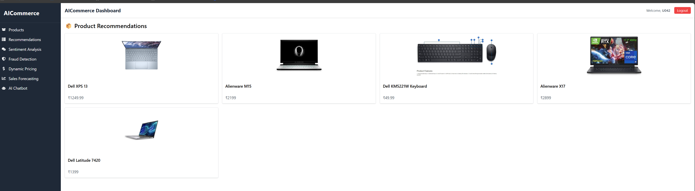
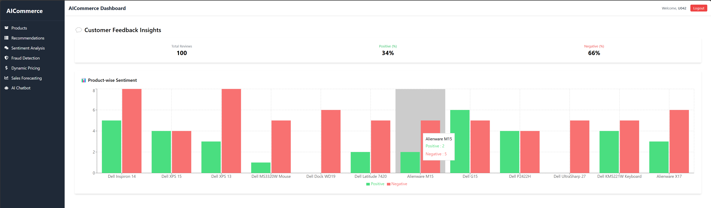

# 🛍️ AICommerce – AI-Powered E-Commerce Platform

Welcome to **AICommerce** – an intelligent full-stack e-commerce platform powered by **Machine Learning, Deep Learning, and Generative AI**.  
This project simulates a real-world enterprise system combining modern web development with AI capabilities.




---

## 🚀 Features

- 🧠 **Product Recommendation System** (Content-based & Deep Learning)
- 💬 **AI Chatbot** for user assistance (rule-based + Gemini fallback)
- 📈 **Sales Forecasting** using time series models
- 🎯 **Dynamic Pricing Optimization** with ML
- 🗣️ **Sentiment Analysis** on product reviews
- 🛡️ **Fraud Detection** system for transactions

---

## 🧱 Tech Stack

| Frontend | Backend (.NET Core) | AI Services (FastAPI) | Database       |
|----------|---------------------|------------------------|----------------|
| React    | C# (.NET Web API)   | Python + TensorFlow    | MongoDB / SQL  |

---

## 📂 Project Structure

AICommerce/
├── AICommerce_ui/          --> React Frontend  
├── AICommerce_api/  
│   ├── WebAPI/             --> .NET Core Backend  
│   ├── AIService/          --> FastAPI + AI models  
│   └── Data/               --> MongoDB/SQL setup  

---

## 🧪 How to Run Locally

```bash
# 1. Clone the repository
git clone https://github.com/MathanGit-1/AICommerce.git

# 2. Follow the README in each folder to run:
#    - Frontend (React)
#    - Backend (Web API)
#    - AIService (FastAPI with Python)
